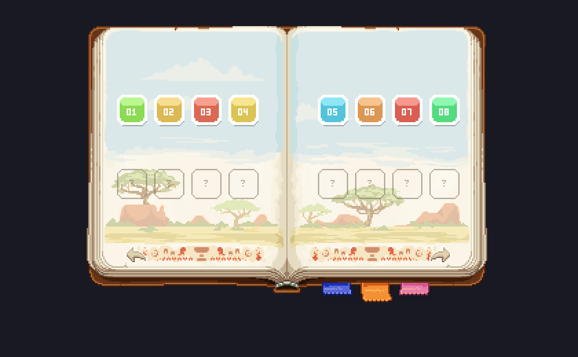
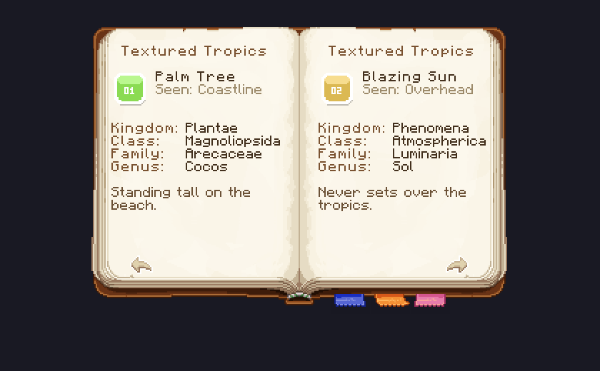

# Building a dynamic book in Minecraft

This repository is a working, self-contained rebuild of the Smithed Summit sticker book, stripped of
everything Summit specific so the mechanism is visible, then extended into a field guide. It is a nineteen
page book: a cover, two index spreads holding sixteen sticker slots each, and one entry page per pair of
stickers. Slots start empty and fill in as the player finds things, and clicking any slot opens its entry,
found or not.






Everything you see above is text. There is no GUI, no custom renderer, no entity. It is one `dialog`
command, one translation key, and one font.

---

## The three ideas

Before any code, three ideas do all the work. If you understand these, the rest is bookkeeping.

**1. A book is a dialog.** Since 1.21.6 a datapack can push an arbitrary window onto the player's screen
with `dialog show`. The window can hold text, and text can hold click and hover events. That is the whole
interface budget: a paragraph of text you are allowed to click.

**2. A font is a layout engine.** A resource pack font maps characters to images and to horizontal
offsets. Offsets are allowed to be negative. So "print this image, then move the cursor back 292 pixels,
then print that image" is a perfectly ordinary string. Once you can move the cursor anywhere, a paragraph
of text becomes a canvas.

**3. An advancement is a save file.** Advancements are stored per player, survive restarts, are queryable
from a selector, and pop a toast for free when granted. That makes them the natural place to record "this
player has found the parrot".

The book is those three things wired together: the font draws it, the dialog shows it, the advancements
decide what gets drawn.

Parts 1 to 6 build the index pages, which are hand written and small enough to read. Part 7 covers the entry
pages, which are generated by a beet plugin, and explains what forces that: the moment a page contains left
aligned text, its geometry depends on how wide that text is, and only a build step can know.

---

## Part 1: Fonts

A font lives at `assets/<namespace>/font/<name>.json` and is a list of providers. Two kinds matter here.

### Bitmap providers

```json
{
  "type": "bitmap",
  "file": "sticker_book:book/tropics_page_left.png",
  "ascent": 11,
  "height": 195,
  "chars": ["\ue001"]
}
```

This says: the character `\ue001`, in this font, is that PNG.

- **`height`** is how tall the image is drawn, in pixels. The width follows the aspect ratio. The source
  PNG here is 146x195 and `height` is 195, so it draws at its native size. Set `height` to 390 and it
  draws twice as large, blurry, at 292x390.
- **`ascent`** is how far above the baseline the top of the image sits. Positive lifts it, negative drops
  it. An ascent of 11 on a 195 tall image means 11 pixels above the baseline and 184 below it: the page
  hangs down from the line it is written on.
- **`chars`** are the characters this provider defines. Use the Unicode private use area, `U+E000` to `U+F8FF`, so you never collide with a character a player might actually type.

The one number that is not in the JSON is the **advance**: how far the cursor moves after drawing. For a
bitmap glyph it is the drawn width plus one pixel. That `+1` is the source of most off-by-a-few font bugs,
so it is worth burning in:

```
   baseline
   |
   |    +-----------------+
   |    |                 |  ^
   |    |    the image    |  | height
   |    |                 |  v
---+----+-----------------+------------------
   |<-->|                 |
   ascent (negative here, so the glyph sits below the baseline)

   |<--- drawn width ---->|<->|
                            +1
   |<------- advance ---------->|
```

### Space providers

```json
{
  "type": "space",
  "advances": {"\ud000": -292, "\ud001": 38, "\ud002": 204}
}
```

A space provider defines characters that draw nothing and move the cursor by an exact amount. No `+1`,
no image, just movement. Negative values move the cursor backwards, which is what lets you draw two things
on top of each other, or draw the right page first and then back up to draw the left one.

Positive spaces are padding. Negative spaces are the interesting half.

### Centering

The last rule you need: **a dialog body centres every line on its own total advance.** Add up the advance
of every character on the line, call it `W`, and the line starts at `x = -W/2` relative to the centre of
the body.

That is not a detail, it is the coordinate system. It means you never position anything absolutely. You
position it by controlling the total width of the line it lives on. Every space value in this pack was
derived from that one equation.

### Worked example: drawing a two-page spread

The two page images are 146x195 (left) and 145x195 (right). Their advances are 147 and 146. We want the
spread centred, so the seam between the pages lands at x = 0.

The line is written as: right page, then a big negative space, then left page.

```
\ue002        draw the right page      advance +146,  cursor now at start+146
\ud000        jump backwards           advance -292,  cursor now at start-146
\ue001        draw the left page       advance +147,  cursor now at start+1
```

Total advance `W = 146 - 292 + 147 = 1`, so the line starts at `x = -0.5`. The right page is drawn from
-0.5 to 144.5, and the left page from -146.5 to -0.5. They meet at the origin, and the whole spread is
centred. The `-292` is simply `-(146 + 146)`: back over the page just drawn, then back over the page about
to be drawn.

Now a row of stickers on that spread, and here is where the trimming rule earns its keep. A sticker slot is
a 26x26 image, but its art stops at column 24, so `actualGlyphWidth` is 24 and it **advances 25, not 27**.
Four of them advance 100 while the row is visually 101 wide, because the last glyph still draws its full 26
pixels. Writing `G` for the gap between the two rows:

```
W = 100 + G + 100
left row is centred at   -W/2 + 50.5  =  -49.5 - G/2   ->  we want -73.5  ->  G = 48
right row is centred at   50.5 + G/2                   ->  we want  72    ->  G = 43
```

Two answers, which is the honest result: the two centres always sum to 1, while the targets sum to -1.5,
because the left page is 146 wide and the right one is 145. There is a fixed 2.5 pixels of error to put
somewhere. `퀁 = 47` splits it, leaving the left row half a pixel off and the right row two.

That is the entire derivation of every magic number in `font/assets.json`, and it is worth insisting on the
part that is easy to get wrong: **use the trimmed advance, not the image width**. Assuming 27 here pulls
every row two pixels per slot toward the spine, eight pixels across a spread, on a page nobody thought to
measure.

### Iterating without launching the game

`tools/preview_book.py` implements exactly the rules above, reads the real font and lang files, and writes
a PNG. Every image in this document came out of it, which makes each one a test: the preview re-derives the
advances from the same PNGs the game reads, so if the geometry is wrong the preview is wrong the same way.

```sh
python tools/preview_book.py docs/img
```

---

## Part 2: The lang file is the layout

You could put the whole page into the `dialog` command as one long string of private use characters. Do
not. Put it in the lang file instead, and keep the command holding only the pieces that change.

`assets/sticker_book/lang/en_us.json`:

```json
"gui.sticker_book.page.spread": "%1$s\ud000%2$s\n\n\n\n%3$s\ud001%4$s\n\n\n\n\n\n%5$s\ud001%6$s\n\n\n\n\n%7$s\n%8$s\n\n\n\n",
"gui.sticker_book.row": "%1$s%2$s%3$s%4$s"
```

A `translate` component fills `%1$s`, `%2$s` and so on from its `with` list. Read the spread template as a
grid, one line per line of text:

| Line | Content | What it is |
|:--|:--|:--|
| 1 | `%1$s\ud000%2$s` | right page, jump back, left page |
| 5 | `%3$s\ud001%4$s` | first row of slots on each page |
| 11 | `%5$s\ud001%6$s` | second row of slots on each page |
| 16 | `%7$s` | the previous / next arrows |
| 17 | `%8$s` | the tab strip |

Blank lines do the vertical spacing, nine pixels each. Rows land at 37 and 91 pixels below the top of the
page, and the tabs at 176, which is past the bottom edge of the 195 pixel page image, so they stick out
underneath like real book tabs.

Three reasons this belongs in the lang file and not in the command:

- **Translators get the layout for free.** A German page needs different spacing? That is a lang file, not
  a datapack edit.
- **The command stays readable.** `{translate: 'gui.sticker_book.row', with: [...]}` says what it is.
  A 400 character run of `\ue1xx` does not.
- **Templates nest.** `row` is used inside `page.spread`, which keeps the argument count of each template
  small enough to hold in your head.

---

## Part 3: The dialog

`src/data/sticker_book/function/page/2/dialog.mcfunction`, trimmed to its skeleton:

```mcfunction
$dialog show @s { \
    type: 'minecraft:multi_action', \
    title: {translate: 'gui.sticker_book.title'}, \
    body: [{ \
        type: 'minecraft:plain_message', \
        width: 291, \
        contents: { \
            translate: 'gui.sticker_book.page.spread', font: 'sticker_book:assets', color: 'white', shadow_color: 0, \
            with: [ ... ] \
        } \
    }], \
    inputs: [], \
    can_close_with_escape: true, \
    pause: false, \
    after_action: 'none', \
    actions: [{label: {translate: 'gui.sticker_book.done'}, width: 291, action: {...}}] \
}
```

Points worth stopping on:

- **`font: 'sticker_book:assets'`** on the outer component. Set it once and every nested component inherits
  it, so you never repeat it on 16 slots.
- **`shadow_color: 0`** kills the drop shadow. Without it every page image is drawn twice, offset by one
  pixel, in black. It is the first thing to check when a page looks muddy.
- **`width`** on a `plain_message` is the wrapping width, not the window width. The window is sized by the
  widest action button, which is why the cover uses 211 and the spreads use 291.
- **`pause: false`** matters on a server. `after_action: 'none'` stops the Done button from closing the
  window on its own, because we want to close it ourselves.

### Why every click goes through a trigger

A click event inside the body runs a command *as the player*, which means it runs at permission level 0.
It cannot run `function`, and it cannot run `dialog`. What it can run is `trigger`.

So every clickable thing in the book does the same thing: set a number.

```mcfunction
click_event: {action: 'run_command', command: 'trigger sticker_book.action set 2'}
```

And one line in `tick.mcfunction` picks that number up at operator level:

```mcfunction
execute as @a[scores={sticker_book.action=1..}] at @s run function sticker_book:action/main
```

`action/main.mcfunction` is the whole input handler:

```mcfunction
# 1 = previous page, 2 = next page, 3 = close the book, 1x = jump straight to page x

execute if score @s sticker_book.action matches 3 run function sticker_book:action/close
execute if score @s sticker_book.action matches 1 run scoreboard players remove @s sticker_book.page 1
execute if score @s sticker_book.action matches 2 run scoreboard players add @s sticker_book.page 1
execute if score @s sticker_book.action matches 11.. run function sticker_book:action/goto_page

# Closing put the trigger back to 0, so only a page change ever reaches this line
execute if score @s sticker_book.action matches 1.. run function sticker_book:open
```

The tab values are deliberately `page + 10`. Three tabs, and no per-tab function: `goto_page` copies the
trigger into the page score and subtracts 10. Add a fourth spread and the tab strip needs no new code.

The redraw is not clever and does not need to be. Change the page number, call `open` again, `open` shows
the dialog again. Minecraft replaces the open window rather than stacking a second one, so from the player's
side it reads as a page turn.

---

## Part 4: Per-player state

This is the part Gneiss actually asked about: a slot that is greyed out until the player finds the thing.


### One advancement per spread, one criterion per sticker

The obvious shape is one advancement per sticker, and it works, but it means 32 near-identical files. It is
also more than you need, because **an advancement can hold many criteria and a selector can test one of
them**:

```mcfunction
execute if entity @s[advancements={minecraft:nether/all_effects={speed=true}}]
```

That is how the vanilla "How Did We Get Here" advancement is queried, and it is exactly the shape a sticker
page wants. So the whole book is four advancement files instead of 35.

`src/data/sticker_book/advancement/sticker/tropics.json`:

```json
{
  "parent": "sticker_book:root",
  "criteria": {
    "palm": {"trigger": "minecraft:impossible"},
    "sun": {"trigger": "minecraft:impossible"},
    "...": "one per sticker, sixteen of them"
  },
  "rewards": {"function": "sticker_book:on_spread_complete"}
}
```

What that buys:

- `minecraft:impossible` means no criterion can ever be earned by playing. They are granted by command,
  which makes each one a flag you control rather than a condition you hope fires.
- Criteria are saved per player, forever, with no scoreboard to maintain and nothing to reset on death.
- `advancements={sticker_book:sticker/tropics={palm=true}}` reads one back.
- With `requirements` omitted, **every criterion is required**, so the advancement completes exactly when
  the spread is full. `rewards.function` is therefore a free "this spread is done" event.

Granting a single criterion has its own command form:

```mcfunction
advancement grant @s only sticker_book:sticker/tropics palm
```

The parent `sticker_book:root` has **no `display` field at all**. An advancement tree whose root has no
display never appears in the advancement screen, so the whole thing is invisible in the GUI while still
toasting normally. That is the trick that keeps a collectible system from spamming the vanilla
advancement tab.

### What regrouping costs you

One thing does not survive the merge: **the toast**. A toast fires when an advancement completes, not when
a criterion lands, so sixteen stickers sharing one advancement would toast once, at the end.

The fix is to stop getting the toast for free and grant one deliberately. `sticker_book:toast` is a single
advancement carrying nothing but the display, and `on_sticker_found` revokes it before granting it so the
same one can fire again:

```mcfunction
# Revoking first is what lets the same advancement toast again on the next sticker
advancement revoke @s only sticker_book:toast
advancement grant @s only sticker_book:toast

playsound minecraft:entity.player.levelup player @s ~ ~ ~ 0.6 1.6
```

Revoke-then-grant rather than grant-then-revoke, because the toast is queued client side when the grant
arrives and you want the advancement to still be granted when that happens.

If your toast needs to name the sticker it is for, that is the point where per-sticker advancements earn
their keep again: the toast title is a text component, so one file per sticker buys you one title per
sticker. This book's toast just says "Sticker found!", so it does not.

### The unlock path

`rewards.function` no longer fires per sticker, so the guard moves into `unlock.mcfunction`, which is the
one entry point the rest of the pack uses:

```mcfunction
# function sticker_book:unlock {spread:"tropics",sticker:"palm"}
$execute unless entity @s[advancements={sticker_book:sticker/$(spread)={$(sticker)=true}}] run function sticker_book:on_sticker_found
$advancement grant @s only sticker_book:sticker/$(spread) $(sticker)
```

The `unless` runs before the grant, so the toast and the sound only happen the first time. Macros substitute
textually, which is why `$(sticker)` works inside the selector.

Completion needs no counter at all. Each spread advancement completes on its own, and its reward asks
whether the others are done too:

```mcfunction
execute if entity @s[advancements={sticker_book:sticker/tropics=true,sticker_book:sticker/plateaus=true}] run advancement grant @s only sticker_book:all_stickers
```

Note the two forms side by side: `{name=true}` tests one criterion, `=true` tests the whole advancement.

### Testing it

Three dev functions, and the middle one is the useful one:

| Function | What it does |
|:--|:--|
| `sticker_book:dev/unlock_all` | `advancement grant @s from sticker_book:root`, every criterion at once |
| `sticker_book:dev/unlock_random_half` | Flips a coin per sticker against a `random_chance` predicate |
| `sticker_book:dev/reset` | `advancement revoke @s from sticker_book:root` |

`unlock_random_half` exists because an all-or-nothing book only ever shows you two of the states. A random
half puts every index page in a partly filled state and, more importantly, hits all four found / not found
variants of the entry pages from Part 7 in a single run. Run it twice and the book fills in further.

The placeholder stickers are numbered **across the whole book**, 01 to 32, rather than restarting at 01 on
each spread. It is a one line change in the generator and it means flipping from one page of placeholders
to the next is visibly a different page instead of the same eight squares again.

### Turning state into a page

The dialog itself is static text. What varies is the 16 arguments handed to it, and those come from
storage through a macro function.

`page/2/check.mcfunction`:

```mcfunction
# Start from a fully locked page, then reveal only what this player has already found
data modify storage sticker_book:temp page set from storage sticker_book:const locked_page

execute if entity @s[advancements={sticker_book:sticker/tropics/palm=true}] run \
    data modify storage sticker_book:temp page.slot_1 set value "{translate:'gui.sticker_book.sticker.tropics.palm', ...}"
... one line per slot ...

function sticker_book:page/2/dialog with storage sticker_book:temp page
```

The shape is: start from the locked page, overwrite what is unlocked, hand the result to the dialog. The
locked page is built once at load time in `const.mcfunction` and copied per open, so the common case is one
`data modify` instead of sixteen.

Each slot value is a **text component stored as a string**. Macro substitution pastes the string in raw, so
what lands in the command is a real component and not a quoted one. Two rules keep that working:

- Use single quotes inside, because the outer NBT string uses double quotes.
- Never put a newline in it. The tooltip in this pack has two lines, and the newline lives in the lang file
  (`"gui.sticker_book.tooltip": "%1$s\n%2$s"`) precisely so the stored string stays flat.

Sixteen `execute if entity` checks per page open sounds like a lot and is not: it runs once, when a player
opens the book, on one player. Nothing here is on the tick loop.

---

## Part 5: The plumbing

Small, and worth reading once so nothing looks like magic.

| File | Job |
|:--|:--|
| `load.mcfunction` | Creates the three scoreboards, sets `$max` to the page count, kicks off the one second loop |
| `tick.mcfunction` | Two lines: someone right clicked a book, someone clicked in a dialog |
| `second.mcfunction` | Reschedules itself and hands the book back to anyone missing it |
| `on_use.mcfunction` | The `used:written_book` statistic fires for *every* written book, so the held item is checked with a predicate |
| `open.mcfunction` | Re-arms the trigger, clamps the page, plays the page turn, calls the page by number |
| `open_page.mcfunction` | `$function sticker_book:page/$(page)/check` |
| `unlock.mcfunction` | The one entry point anything else calls to award a sticker |
| `dev/` | `unlock_all`, `unlock_random_half`, `reset` |

The book is given by the loop rather than on join, so losing it is self-healing and there is no join event
to hook. A once-per-second predicate check over online players is not something you will ever see in a
profiler.

---

## Part 6: Adding a sticker

Everything repetitive in `src/` is generated from one table, so adding a sticker stays a small change. By
hand, one new sticker means:

1. A 26x26 PNG in `textures/sticker/<spread>/<id>.png`.
2. A bitmap provider in `font/assets.json` claiming the next free `\ue1xx` character.
3. Three lang keys: the glyph, the name, the description.
4. One criterion in `advancement/sticker/<spread>.json`.
5. One `execute if entity` line in the spread's `check.mcfunction`.
6. A row in the plugin's `entries.py`, so it gets an entry page too.

Regrouping the advancements in Part 4 deleted what used to be a seventh step, bumping a hardcoded total,
and turned step 4 from a whole new file into a single line. Steps 2 through 6 are still exactly the kind of
thing to stop doing by hand once the list passes about twenty entries, which is why
`tools/generate_stickers.py` does 1 to 5 and the plugin does 6.

---

## Part 7: Entry pages, and why they need a build step

Everything so far has been hand written, because everything so far has been made of glyphs whose width you
already know. Text is different. Look at what the reference field guide actually asks for:


A heading centred on each page, an icon, a name beside it, four label and value pairs lined up in two
columns, and a wrapped paragraph. Six of those seven things are left aligned, and Part 1 established that a
dialog body centres every line on its own total advance. Centring is free. Left aligning is not.

### The one equation

Take a line holding runs of advance `t0..tn` that you want to start at `x0..xn`, and write `p` for the pad
inserted before each run. The pads after the first are just the gaps you would expect:

```
p[i] = x[i] - x[i-1] - t[i-1]
```

The first pad is the interesting one. Padding the front of a line by twice the position you want cancels the
centring exactly, and the rest of the line is a correction term:

```
p[0] = 2 * x[0] + sum(p[1:]) + sum(t)
```

Check it with a single run: `p[0] = 2*x0 + t0`, so `W = 2*x0 + 2*t0`, the line starts at `-W/2 = -x0 - t0`,
and the run lands at `-x0 - t0 + 2*x0 + t0 = x0`. That is [layout.py](src/entry_pages/layout.py), all
fourteen lines of it.

One corollary is worth keeping: **centring a run at position `c` needs no measurement at all**, because a
lone leading pad of `2c` puts the run's centre at `(a - b) / 2 = c` whatever its width. That is how the
headings are placed, and it is the cheapest trick in the file.

### So you have to measure the font

Every `t` in those formulas is a real pixel width, and getting it wrong shifts everything after it on the
line. The formula is in `BitmapProvider`:

```java
(int)(0.5 + actualGlyphWidth * pixelScale) + 1
```

`pixelScale` is `height / cell_height`, and `actualGlyphWidth` is one past the rightmost column of the cell
that holds a non transparent pixel. Bold adds one more pixel per glyph, from `GlyphInfo.getBoldOffset`.

[metrics.py](src/entry_pages/metrics.py) implements exactly that, reading the PNG. Not a hardcoded width
table: the whole point is that you can redraw the font and the pages stay correct.

**That trimming rule bites.** A sticker is a 26x26 PNG, but its art stops at column 24, so it advances 25
and not 27. The index rows in Part 1 were originally derived assuming 27, which quietly pushed every row two
pixels per slot toward the spine. Eight pixels across a spread, on a page nobody had measured. If you take
one practical thing from this section, take this: **a glyph advances by its trimmed width, not by its
image width.**

### A body font you can measure

`ascii_tall.png` is a normal 8x8 pixel font sitting in the top of an 8x22 cell, with the rest of each cell
transparent padding for the toast. Cropping every cell to its top eight rows gives a plain 8 pixel ASCII
sheet, which the plugin generates and registers:

```python
small.paste(tall.crop((0, row * cell_height, tall.width, row * cell_height + 8)), (0, row * 8))
ctx.assets.textures["sticker_book:font/ascii_small"] = Texture(small)
```

Two rules matter when adding it to the existing font:

- **Providers are searched in order and the first match wins** (`FontSet.computeGlyphInfo`). The cropped
  sheet has to come before `minecraft:include/default`, or vanilla's glyphs would win and every measurement
  would be off by a pixel here and there.
- `minecraft:include/space` goes in too, otherwise U+0020 would be an empty cell and advance 1 instead of 4.

### Offsets as characters

A space provider maps characters to exact advances, so pads have to be spelled out in characters. Rather
than mint a character per distinct pad, the plugin defines a small alphabet: one character per decimal digit
per magnitude, in both signs. Seventy two characters cover every offset under 10000, and any pad costs at
most four of them.

```
-137  ->  <-100><-30><-7>
```

Debugging is much easier when the encoding is readable. Binary decomposition is fewer characters on average
and considerably harder to eyeball in a lang file.

### Four variants per page, decided at build time

Here is the annoying consequence of the equation: `p[0]` depends on the width of everything else on the
line. On an entry spread, the left half and the right half share their lines, so **whether the left entry is
found changes where the right entry starts**. The padding is not a property of one entry, it is a property
of the pair.

You cannot fix that up at runtime, because a datapack cannot measure text. So the plugin solves all four
combinations at build time and the datapack only has to pick one:

```mcfunction
# One line per variant, so nothing has to be recomputed while the book is open
execute unless entity @s[advancements={sticker_book:sticker/tropics/palm=true}] unless entity @s[advancements={sticker_book:sticker/tropics/sun=true}] run function sticker_book:page/4/ll
execute if     entity @s[advancements={sticker_book:sticker/tropics/palm=true}] unless entity @s[advancements={sticker_book:sticker/tropics/sun=true}] run function sticker_book:page/4/fl
execute unless entity @s[advancements={sticker_book:sticker/tropics/palm=true}] if     entity @s[advancements={sticker_book:sticker/tropics/sun=true}] run function sticker_book:page/4/lf
execute if     entity @s[advancements={sticker_book:sticker/tropics/palm=true}] if     entity @s[advancements={sticker_book:sticker/tropics/sun=true}] run function sticker_book:page/4/ff
```

32 entries, two per spread, four variants each: 64 generated dialog functions and 16 checks. That is a lot
of files and none of them are yours to maintain, which is the trade. It also caps how many entries fit on a
spread: three per page would be eight variants, four would be sixteen.

The index pages avoid all of this because their slots are fixed width glyphs, which is why they can stay
hand written and macro driven while entry pages cannot.

### The width trap

The plugin will happily compute a line that Minecraft refuses to draw. Working out the total advance of a
composed line is worth doing once, because it has a tidy closed form: the line starts at `-W/2` and the last
run ends at `W/2`, so

```
W = 2 * (x of the last run + its advance)
```

**The line width is twice the right edge of whatever is written last.** Draw the left page first and then
the right, and line 1 advances `2 * (0 + 146) = 292`. The body is 291 wide. One pixel over, and
`FocusableTextWidget` wraps the line: the left page stays on line 1, the right page moves to line 2, and the
spread renders as two pages stacked nine pixels apart, which reads as a single page in the middle of a
dialog full of text that has spilled off both sides of it.

The fix is the order, not the arithmetic. Write the rightmost run first:

```python
lines[PAGE_LINE] = [
    Run(x=0, text=right_page),
    Run(x=-146, text=left_page),
]
```

Now the last run is the left page, ending at `-146 + 147 = 1`, so `W = 2`. This is the same reason the index
pages in Part 1 are written as right page, jump back, left page rather than the other way round: it was
never about drawing order, it was about keeping the line narrow enough not to wrap.

`Layout.line` now raises at build time when a line would exceed the body, and `preview_book.py` prints a
warning for the same condition, since neither of them can render a wrap faithfully.

### What the plugin reads

[src/entry_pages/](src/entry_pages/) does not restate anything the pack already knows. Names, descriptions,
sticker glyphs and spread titles are read back out of `ctx.assets` at build time, so the lang file stays the
single source of truth:

```python
name = lang[f"sticker.sticker_book.{key}"]
glyph = lang[f"gui.sticker_book.sticker.{key}"] if found else lang["gui.sticker_book.slot.locked"]
```

[entries.py](src/entry_pages/entries.py) only carries what an entry page adds on top: where the thing is
seen, and its four taxonomy lines. One row per sticker, in slot order.

| File | Job |
|:--|:--|
| [metrics.py](src/entry_pages/metrics.py) | Measures the font off its PNG, encodes offsets, wraps paragraphs |
| [layout.py](src/entry_pages/layout.py) | The pad equation, and nothing else |
| [entries.py](src/entry_pages/entries.py) | The 32 rows of extra field guide data |
| [render.py](src/entry_pages/render.py) | Where each part of an entry sits, and in what colour |
| [\_\_init\_\_.py](src/entry_pages/__init__.py) | `beet_default`: build the font, emit the pages, wire the datapack |

### Wiring it back into the book

Three small things connect the generated half to the hand written half:

- Every slot on an index page now carries `click_event: trigger sticker_book.action set <100 + index>`.
  `action/open_entry` subtracts the base, divides by the number of entries per page and adds the first entry
  page. No table, no per-entry function.
- The plugin appends `sticker_book:entry/load` to `#minecraft:load`, which raises `$max` from 3 to 19 so the
  page clamp in `open.mcfunction` lets you reach the new pages.
- Locked slots are clickable too, so a player can read what they are missing. That is why the locked
  component moved out of one shared value in `const.mcfunction` into one per slot: a shared component cannot
  carry a per-slot click event.

### One thing you give up

Text baked into a dialog command is not translatable. The index pages keep their layout in the lang file and
stay translatable; entry pages do not, because their spacing is computed from the English strings. A German
translation would need the plugin re-run against a German lang file, producing a second set of pages.

That is not a limitation of the technique, it is a limitation of doing it at build time. It is the same
reason the four variants exist. If you need runtime translation, the escape hatch is to keep every entry
centred rather than left aligned, which needs no measurement at all and therefore no build step.

### Iterating on it

`tools/preview_book.py` reads the generated pages back out of `build/`, walks the dialog component tree,
resolves the translate keys and draws the result. Every image in this document is produced that way, which
means the preview is also a test: it re-derives the advances independently, so if the plugin and the preview
disagree the page comes out visibly wrong. That is how the 26-versus-24 trimming bug was found.

```sh
beet build && python tools/preview_book.py docs/img
```

---

## What is left for a real field guide

The mock-up that started this is a nature journal. Between the index pages and the entry pages, most of it
is already here. What actually differs:

- **The slot art is bigger.** A plant with its name underneath wants maybe 40x56 rather than 26x26. Redo the
  row arithmetic from Part 1 with the new advance, remembering it is the trimmed advance. Nothing else in
  the system cares.
- **Unlocks come from the world.** Anything that can run a function can call `sticker_book:unlock`. An
  advancement on `minecraft:player_interacted_with_entity`, an interaction entity, a `location` trigger for
  a biome, whatever fits. The book does not care where the grant came from, only that the advancement
  exists.
- **More fields, or fields that vary per entry.** `FIELD_LABELS` in [render.py](src/entry_pages/render.py)
  is a tuple; making it per entry is a change to one dataclass and one loop. Watch the vertical budget: a
  195 pixel page is about seventeen usable 9 pixel lines, and navigation and tabs take the last two.
- **Real artwork instead of numbered placeholders.** The 32 generated stickers exist to be replaced. Drop
  PNGs into `textures/sticker/<spread>/` and delete the generator's `Textures` class.

The one structural decision worth making early is how many entries share a spread, because that is what sets
the variant count: two entries is four variants, three is eight, four is sixteen.

---

## File map

```
src/
  assets/sticker_book/
    font/assets.json            page, tab, arrow and sticker glyphs, plus the space advances
    font/toast.json             the toast background strip
    font/advancement_text.json  the tall ascii sheet the entry font is cropped from
    lang/en_us.json             the index page layouts and all visible text
    textures/book/              pages, cover, tabs, arrows, the empty slot
    textures/sticker/           one PNG per sticker
  data/sticker_book/
    advancement/                one file per spread, each holding one criterion per sticker
    function/page/1..3/         cover and index spreads: check picks the state, dialog shows it
    function/action/            the input handler behind the triggers
    function/dev/               unlock_all, unlock_random_half, reset
    predicate/                  has the book, is holding the book, coin flip
  entry_pages/                  beet plugin: pages 4 and up, the body font, the offset alphabet
  patch_json_indent.py          beet plugin: readable JSON in the build output
tools/
  generate_stickers.py          rewrites the derived half of src/ from the sticker table
  preview_book.py               renders any page to PNG, from src/ or from build/
```

Pipeline order in `beet.yml` matters: `src.entry_pages` runs after `mecha` so the hand written functions are
already in `ctx.data`, and before the stewbeet plugins that package the result.

## Credits

The artwork, the book layout and the original implementation are from the Smithed Summit sticker book. This
repository reimplements the mechanism under its own namespace, with placeholder sticker art, so it can be
read and modified without the rest of Summit.
