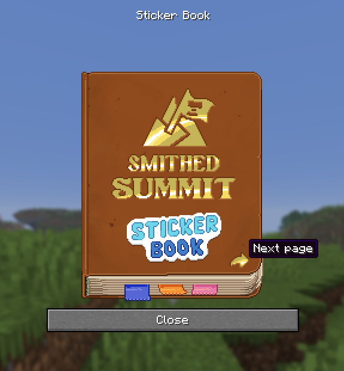
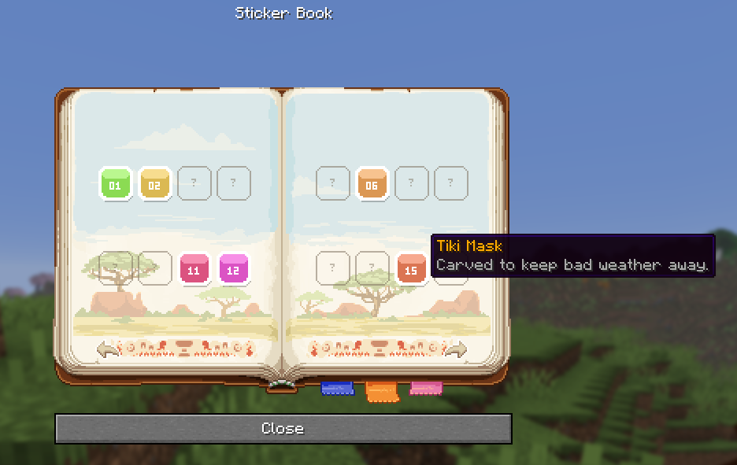

# Part 3: The dialog

A page is one `dialog show` holding one text component. Turning a page is showing the dialog again.



## The command

`src/data/sticker_book/function/page/2/dialog.mcfunction`, down to its skeleton:

```mcfunction
$dialog show @s { \
    type: 'minecraft:multi_action', \
    title: {translate: 'gui.sticker_book.title'}, \
    body: [{type: 'minecraft:plain_message', width: 291, contents: { \
        translate: 'gui.sticker_book.page.spread', font: 'sticker_book:assets', color: 'white', shadow_color: 0, \
        with: [ ... ] \
    }}], \
    can_close_with_escape: true, pause: false, after_action: 'none', \
    actions: [{label: {translate: 'gui.sticker_book.done'}, width: 291, action: {...}}] \
}
```

| Field | Why it is set that way |
|:--|:--|
| `font` on the outer component | Inherited by every nested component, so it is never repeated on sixteen slots |
| `shadow_color: 0` | Kills the drop shadow. Without it every page image is drawn twice, one pixel apart, in black |
| `width: 291` | The wrapping width of the body, not the window width. The window is sized by the widest action button, which is why the cover uses 211 |
| `pause: false` | Matters on a server |
| `after_action: 'none'` | Stops the Close button closing the window on its own, because we close it ourselves |

## Every click goes through a trigger

A click event inside the body runs its command **as the player**, at permission level 0. It cannot run
`function` and it cannot run `dialog`. It can run `trigger`.

So every clickable thing in the book sets a number:

```mcfunction
click_event: {action: 'run_command', command: 'trigger sticker_book.action set 2'}
```

And one line of `tick.mcfunction` picks it up at operator level:

```mcfunction
execute as @a[scores={sticker_book.action=1..}] at @s run function sticker_book:action/main
```

`action/main.mcfunction` is the whole input handler:

```mcfunction
# 1 = previous page, 2 = next page, 3 = close, 1x = jump to page x, 100+i = open entry i

execute if score @s sticker_book.action matches 3 run function sticker_book:action/close
execute if score @s sticker_book.action matches 1 run scoreboard players remove @s sticker_book.page 1
execute if score @s sticker_book.action matches 2 run scoreboard players add @s sticker_book.page 1
execute if score @s sticker_book.action matches 11..13 run function sticker_book:action/goto_page
execute if score @s sticker_book.action matches 100.. run function sticker_book:action/open_entry

# Closing put the trigger back to 0, so only a page change ever reaches this line
execute if score @s sticker_book.action matches 1.. run function sticker_book:open
```

Values are chosen so no case needs its own function. A tab sends `page + 10`, and `goto_page` copies the
trigger into the page score and subtracts 10, so a fourth spread needs no new code. A slot sends
`100 + index`, which Part 6 turns into an entry page the same way.

## The redraw

Change the page number, call `open` again, `open` shows the dialog again. Minecraft replaces the open
window rather than stacking a second one, so from the player's side it reads as a page turn. `open` also
re-arms the trigger, clamps the page against `$max` and plays the page turn sound.

Hover events come free with the same component, and are where the slot names live:



Next: [Part 4: Player state](4-player-state.md).
