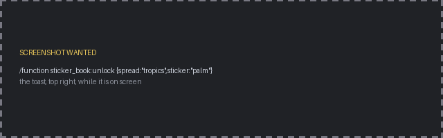

# Part 4: Player state

A slot is greyed out until the player finds the thing. That state is four advancement files and one macro.


## One advancement per spread, one criterion per sticker

One advancement per sticker works and means 32 near identical files. It is also more than you need, because
**an advancement holds many criteria and a selector can test one of them**:

```mcfunction
execute if entity @s[advancements={sticker_book:sticker/tropics={palm=true}}]
```

`advancement/sticker/tropics.json`:

```json
{
  "parent": "sticker_book:root",
  "criteria": {"palm": {"trigger": "minecraft:impossible"}, "sun": {"trigger": "minecraft:impossible"}},
  "rewards": {"function": "sticker_book:on_spread_complete"}
}
```

- `minecraft:impossible` means no criterion is ever earned by playing. Each one is a flag you grant by
  command, not a condition you hope fires: `advancement grant @s only sticker_book:sticker/tropics palm`.
- Criteria are saved per player, forever. No scoreboard, nothing to reset on death.
- With `requirements` omitted, **every criterion is required**, so the advancement completes exactly when
  the spread is full. `rewards.function` is a free "this spread is done" event.
- The parent `sticker_book:root` has **no `display` field**, which hides the whole tree from the
  advancement screen while it still toasts normally.

## What regrouping costs

**The toast.** It fires on completion, not per criterion, so sixteen stickers sharing one advancement would
toast once, at the end. So grant one deliberately: `sticker_book:toast` carries nothing but a display, and
`on_sticker_found` revokes it before granting so the same one fires again.

```mcfunction
# Revoking first is what lets the same advancement toast again on the next sticker
advancement revoke @s only sticker_book:toast
advancement grant @s only sticker_book:toast
playsound minecraft:entity.player.levelup player @s ~ ~ ~ 0.6 1.6
```

Revoke then grant, not the other way round: the toast is queued client side when the grant arrives. If the
toast needs to name its sticker, that is where per-sticker advancements earn their keep again, since a title
is a text component.



## The unlock path

One entry point for the rest of the pack:

```mcfunction
# function sticker_book:unlock {spread:"tropics",sticker:"palm"}
$execute unless entity @s[advancements={sticker_book:sticker/$(spread)={$(sticker)=true}}] run function sticker_book:on_sticker_found
$advancement grant @s only sticker_book:sticker/$(spread) $(sticker)
```

The `unless` runs before the grant, so the toast and the sound only happen the first time. Macros substitute
textually, which is why `$(sticker)` works inside a selector.

Completion needs no counter. Each spread completes on its own and its reward asks about the others:

```mcfunction
execute if entity @s[advancements={sticker_book:sticker/tropics=true,sticker_book:sticker/plateaus=true}] run advancement grant @s only sticker_book:all_stickers
```

Both forms side by side: `{name=true}` tests one criterion, `=true` tests the whole advancement.

## Turning state into a page

The dialog is static text. What varies is the sixteen arguments handed to it, through storage and a macro.

```mcfunction
# page/2/check.mcfunction: start locked, reveal what this player has found, hand it over
data modify storage sticker_book:temp page set from storage sticker_book:const locked_tropics

execute if entity @s[advancements={sticker_book:sticker/tropics={palm=true}}] run \
    data modify storage sticker_book:temp page.slot_1 set value "{translate:'gui.sticker_book.sticker.tropics.palm', ...}"

function sticker_book:page/2/dialog with storage sticker_book:temp page
```

The locked page is built once at load time in `const.mcfunction`, so the common case is one `data modify`
instead of sixteen.

Each slot value is a **text component stored as a string**, pasted in raw by macro substitution. Two rules
keep that working: single quotes inside, because the outer NBT string uses double quotes, and never a
newline. The two line tooltip gets its newline from the lang file
(`"gui.sticker_book.tooltip": "%1$s\n%2$s"`) so the stored string stays flat.

Sixteen `execute if entity` checks per open is nothing: once, on one player, never on the tick loop.

## Testing it

| Function | What it does |
|:--|:--|
| `dev/unlock_all` | `advancement grant @s from sticker_book:root`, every criterion at once |
| `dev/unlock_random_half` | Flips a coin per sticker against a `random_chance` predicate |
| `dev/reset` | `advancement revoke @s from sticker_book:root` |

`unlock_random_half` is the useful one. All or nothing only ever shows two states; a random half puts every
index page in a partly filled state and hits all four entry page variants from Part 6 in one run.

Placeholder stickers are numbered **across the whole book**, 01 to 32, rather than restarting per spread, so
flipping between two pages of placeholders is visibly a different page.

Next: [Part 5: The rest of the pack](5-the-pack.md).
