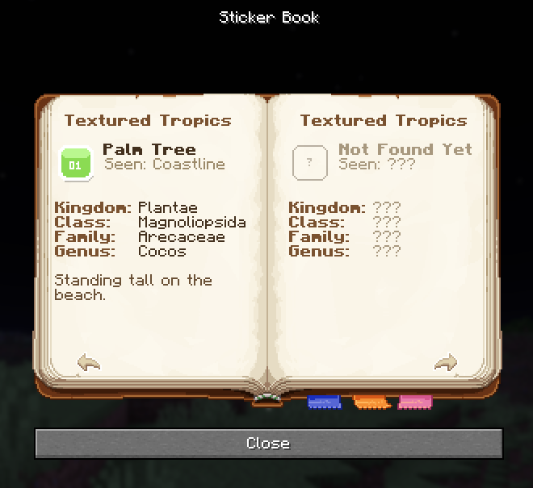

# Part 6: Entry pages

Everything so far was made of glyphs whose width you already knew. Text is different.


A centred heading, an icon, a name beside it, four label and value pairs in two columns, a wrapped
paragraph. Six of those seven are left aligned, and a dialog body centres every line on its own total
advance. Centring is free. Left aligning is not.

Left aligning needs pixel widths and a datapack cannot measure text, so **the pages are computed before the
pack ships**. Here the generator is a beet plugin, but nothing below depends on that: a standalone script
writing `.mcfunction` files would do the same work.

## The one equation

For runs of advance `t0..tn` that should start at `x0..xn`, with `p` the pad before each run:

```
p[i] = x[i] - x[i-1] - t[i-1]
p[0] = 2 * x[0] + sum(p[1:]) + sum(t)
```

Check it with a single run: `p[0] = 2*x0 + t0`, so `W = 2*x0 + 2*t0`, the line starts at `-x0 - t0`, and the
run lands at `x0`. That is [layout.py](../src/entry_pages/layout.py), all fourteen lines of it.

Corollary worth keeping: **centring a run at `c` needs no measurement at all**, because a lone leading pad
of `2c` puts the run's centre at `c` whatever its width. That is how the headings are placed.

## So you have to measure the font

Every `t` above is a real pixel width, and one wrong value shifts everything after it.
[metrics.py](../src/entry_pages/metrics.py) runs the `BitmapProvider` formula from Part 1 against the actual
PNG rather than a hardcoded width table, so you can redraw the font and the pages stay correct.

The body font is `ascii_tall.png`, an 8x8 sheet sitting in the top of an 8x22 cell, the rest transparent
padding for the toast. Cropping each cell to its top eight rows gives a plain ASCII sheet:

```python
small.paste(tall.crop((0, row * cell_height, tall.width, row * cell_height + 8)), (0, row * 8))

# beet for: write this image to assets/sticker_book/textures/font/ascii_small.png
ctx.assets.textures["sticker_book:font/ascii_small"] = Texture(small)
```

It goes into the font **before** `minecraft:include/default`, or vanilla's glyphs win and measurements drift
by a pixel here and there. `minecraft:include/space` goes in too, otherwise U+0020 is an empty cell
advancing 1 instead of 4.

## Offsets as characters

Pads are space characters, so rather than mint one per distinct pad the generator defines an alphabet: one
character per decimal digit per magnitude, in both signs. Seventy two characters cover every offset under
10000, and any pad costs at most four.

```
-137  ->  <-100><-30><-7>
```

Binary decomposition is fewer characters and much harder to eyeball in a lang file.

## Four variants per page

The annoying consequence of `p[0]`: it depends on everything else on the line. The two halves of a spread
share their lines, so **whether the left entry is found changes where the right entry starts**. Padding
belongs to the pair, not to one entry.

So the generator solves all four combinations, writes one dialog per combination, and the datapack picks:

```mcfunction
# One line per variant, so nothing is recomputed while the book is open
execute unless entity @s[advancements={sticker_book:sticker/tropics={palm=true}}] unless entity @s[advancements={sticker_book:sticker/tropics={sun=true}}] run function sticker_book:page/4/ll
execute if     entity @s[advancements={sticker_book:sticker/tropics={palm=true}}] unless entity @s[advancements={sticker_book:sticker/tropics={sun=true}}] run function sticker_book:page/4/fl
```

The generated variants are [`page/4/ll.mcfunction`](../build/datapack/data/sticker_book/function/page/4/ll.mcfunction) and
[`page/4/fl.mcfunction`](../build/datapack/data/sticker_book/function/page/4/fl.mcfunction); the other two use the same naming scheme.

32 entries, two per spread, four variants each: 64 generated dialogs and 16 checks, none of them yours to
maintain. It also caps entries per spread, since three per page is eight variants and four is sixteen. Index
pages avoid all of this because their slots are fixed width glyphs.

## The width trap

A generator will happily compute a line Minecraft refuses to draw. The total advance has a tidy closed form,
since the line starts at `-W/2` and the last run ends at `W/2`:

```
W = 2 * (x of the last run + its advance)
```

**The line width is twice the right edge of whatever is written last.** Draw the left page then the right,
and line 1 advances `2 * (0 + 146) = 292` against a body 291 wide. One pixel over, and `FocusableTextWidget`
wraps it: left page on line 1, right page on line 2, nine pixels apart, which reads in game as one page with
content spilling off both sides.

The fix is the order, not the arithmetic. Write the rightmost run first:

```python
lines[PAGE_LINE] = [Run(x=0, text=right_page), Run(x=-146, text=left_page)]
```

The last run is now the left page, ending at `-146 + 147 = 1`, so `W = 2`. Same reason the index pages in
Part 2 are written right page, jump back, left page: never about draw order, always about not wrapping.
`Layout.line` refuses to emit a line wider than the body, and `preview_book.py` warns on it.

## The generator

It restates nothing the pack already knows: names, descriptions, glyphs and spread titles are read back out
of the lang file it is about to ship, which stays the single source of truth.

| File | Job |
|:--|:--|
| [metrics.py](../src/entry_pages/metrics.py) | Measures the font off its PNG, encodes offsets, wraps paragraphs |
| [layout.py](../src/entry_pages/layout.py) | The pad equation, and nothing else |
| [entries.py](../src/entry_pages/entries.py) | The 32 rows an entry adds: where it is seen, four taxonomy lines |
| [render.py](../src/entry_pages/render.py) | Where each part of an entry sits, and in what colour |
| [\_\_init\_\_.py](../src/entry_pages/__init__.py) | The entry point beet calls: build the font, emit the pages, wire the datapack |

Only that last file is beet shaped: a `beet_default(ctx)` reading and writing `ctx.data` and `ctx.assets`,
the two packs held in memory between `src/` and `build/`. As a standalone script it reads the lang and font
JSON off disk, writes the generated functions into the datapack, and adds its providers to the font.

Three things connect it back to the hand written half:

- Every index slot carries `trigger sticker_book.action set <100 + index>`. `action/open_entry` subtracts the
  base, divides by entries per page and adds the first entry page. No table, no function per entry.
- The generated [`entry/load.mcfunction`](../build/datapack/data/sticker_book/function/entry/load.mcfunction) is added to the
  [`#minecraft:load` function tag](../build/datapack/data/minecraft/tags/function/load.json), raising `$max` from 3 to 19 so the page clamp lets you reach the new pages.
- Locked slots are clickable too, so a player can read what they are missing. That is why the locked
  component moved from one shared value in `const.mcfunction` to one per slot: a shared component cannot
  carry a per-slot click event.



## What you give up

Text baked into a dialog command is not translatable. Index pages keep their layout in the lang file and
stay translatable; entry pages do not, since their spacing comes from the English strings. A German
translation means re-running the generator against a German lang file. That is the cost of computing layout
ahead of time, not of the technique: centred entries need no measurement, and so no generator.

## Iterating on it

`tools/preview_book.py` is plain Python and Pillow, no beet. It reads the built pages back out of `build/`
and draws them, re-deriving the advances independently, so generator and preview disagreeing shows up as a
visibly wrong page. That is how the 26 versus 24 trimming bug was found.

```sh
beet build && python tools/preview_book.py docs/img
```

Next: [Part 7: Going further](7-going-further.md).
